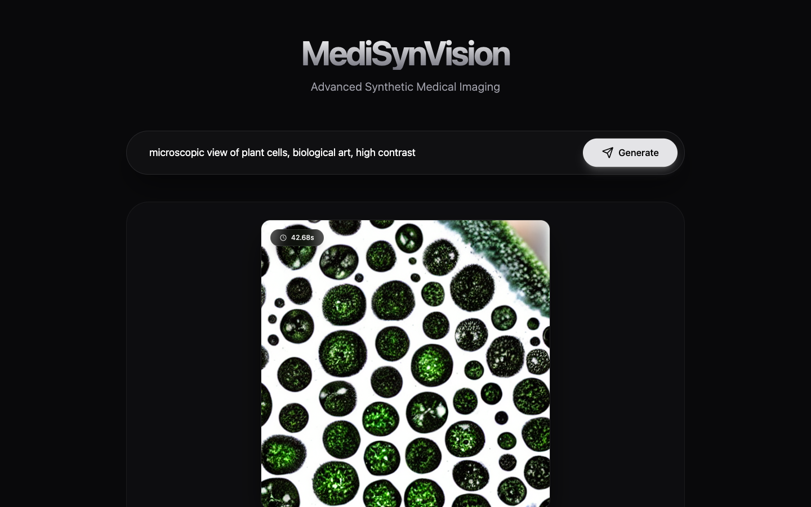

# SynMedVision

**SynMedVision** is a state-of-the-art synthetic medical imaging platform designed to generate high-fidelity histopathology samples using advanced diffusion models.



## Overview

This platform leverages **Stable Diffusion** to generate synthetic medical imagery from natural language prompts. It features a high-performance **FastAPI** backend with hardware acceleration (MPS/CUDA) and a premium, modern **React** frontend designed for research and clinical demonstration.

### Key Features

-   **Text-to-Image Generation**: Generate complex histological patterns using natural language.
-   **Real-Time Inference Tracking**: Precise measurement of generation latency.
-   **Hardware Acceleration**: Native support for Apple Silicon (MPS) and NVIDIA GPUs.
-   **Premium UI**: A "duochromatic" dark-mode interface with glassmorphism and smooth animations.

## Architecture

-   **Backend**: Python 3.10+, FastAPI, Diffusers, PyTorch.
-   **Frontend**: React 19, TypeScript, Vite, TailwindCSS v4.
-   **Model**: Stable Diffusion v1.5 (extensible to fine-tuned medical checkpoints).

## Getting Started

### Prerequisites

-   Python 3.10 or higher
-   Node.js 18 or higher
-   (Optional) GPU or Apple Silicon Mac for faster inference

### 1. Backend Setup

The backend serves the AI model and API endpoints.

```bash
# Create and activate virtual environment
python3 -m venv .venv
source .venv/bin/activate  # On Windows use: .venv\Scripts\activate

# Install dependencies
pip install -r requirements.txt
```

**Start the Server:**
```bash
uvicorn src.api.app:app --reload
```
The API will be available at `http://localhost:8000`.

### 2. Frontend Setup

The frontend provides the user interface.

```bash
cd web

# Install dependencies
npm install

# Start the development server
npm run dev
```

Open [http://localhost:5173](http://localhost:5173) in your browser to use the platform.

## Usage

1.  Enter a prompt describing the tissue or pathology (e.g., *"microscopic view of plant cells, biological art"*).
2.  Click **Generate**.
3.  Wait for the inference to complete (time will be displayed on the image).
4.  Download the high-resolution result.

## License

MIT License. See [LICENSE](LICENSE) for details.
